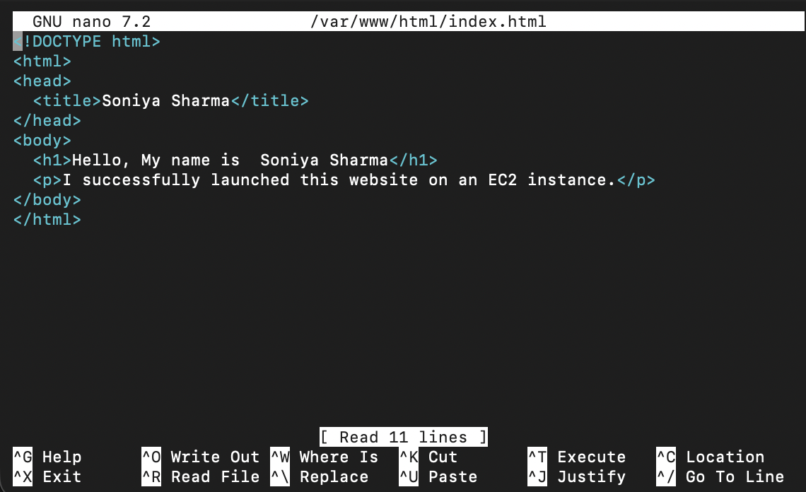
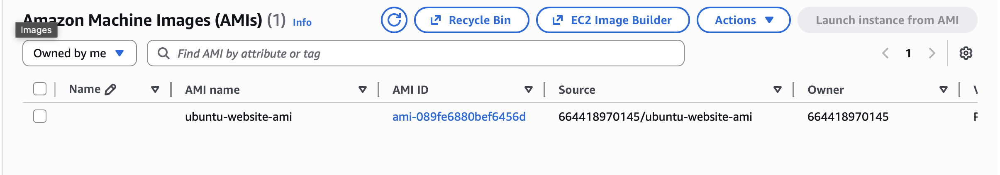
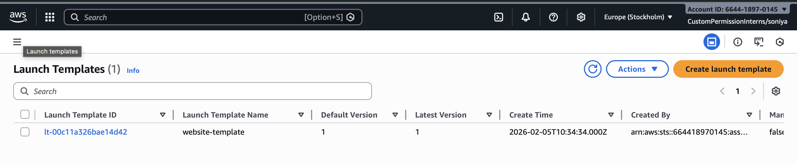
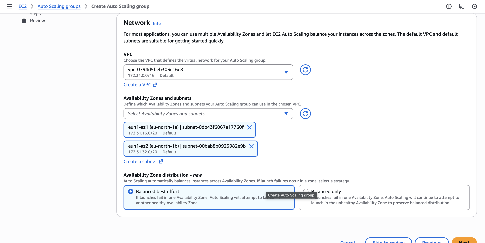
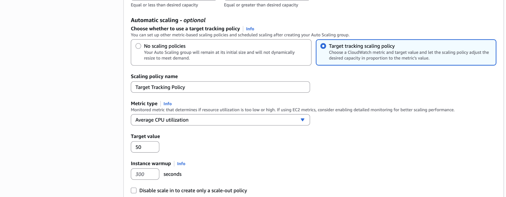
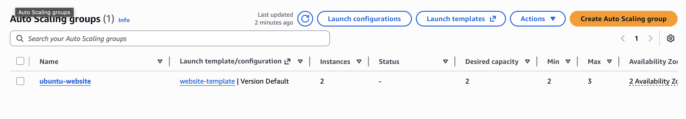
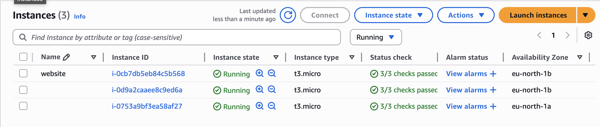

### Host a website on ec2, Scale the website with autoscaling using scaling policies

1. Launched an EC2 instance
   Select **Ubuntu Server 24.04 LTS**.
   Instance type: t3.micro.
   Security group rules:

   * SSH: port 22
   * HTTP: port 80

   

2. Connected to the instance

   ```
   ssh -i key.pem ubuntu@<public-ip>
   ```

3. Installed Apache web server

   ```
   sudo apt update
   sudo apt install apache2 -y
   ```

4. Start and enable Apache

   ```
   sudo systemctl start apache2
   sudo systemctl enable apache2
   ```

5. Created a simple website

   ```
   sudo nano /var/www/html/index.html
   ```
   


6. Verifying the website
  
---

### Part 2: Prepare the instance for scaling

1. Created an AMI
   From the EC2 console, created an image of this Ubuntu instance.

   

2. Created a Launch Template

   * AMI: the one you created
   * Instance type: t2.micro
   * Security group: allow HTTP and SSH
   

---

### Part 3: Configure Auto Scaling

1. Created an Auto Scaling Group

   * Launch template: select the Ubuntu template
   * Availability Zones:  two
   * Desired capacity: 2
   * Min: 2
   * Max: 3
   


2. Added scaling policies
   Use target tracking scaling.
   * Average CPU utilization: 50 percent
   
   

---

### Auto Scaling




