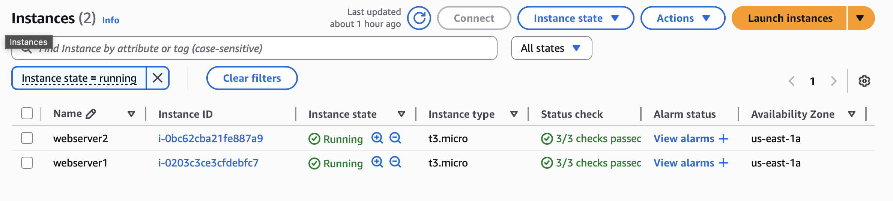
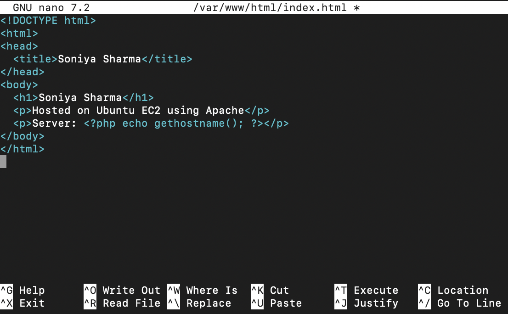
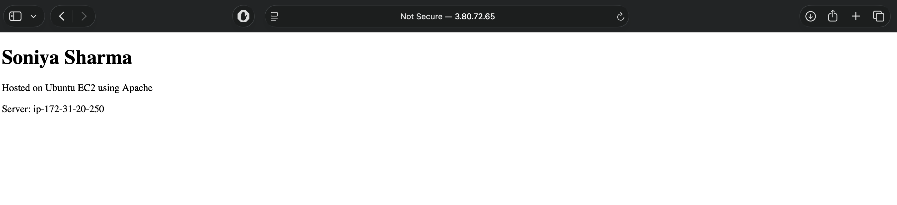
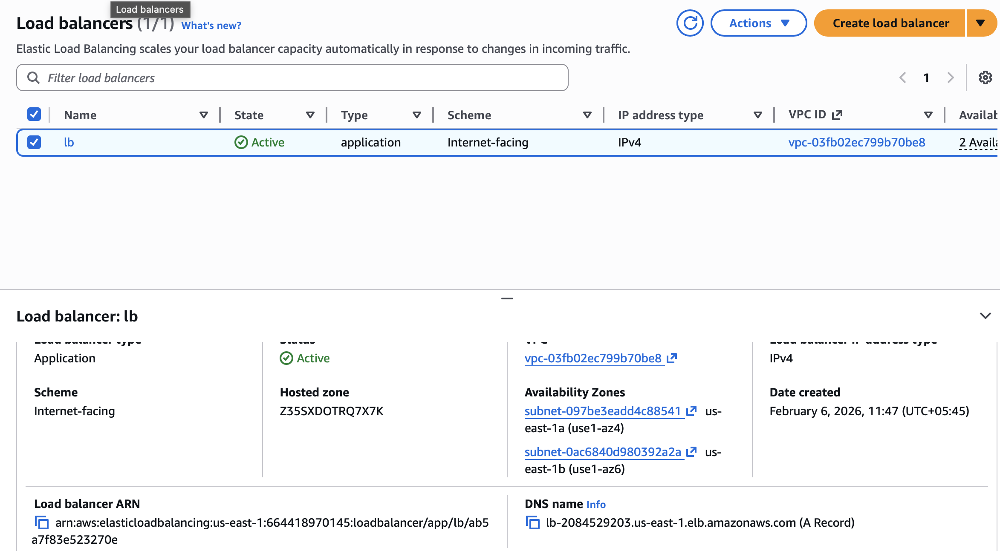
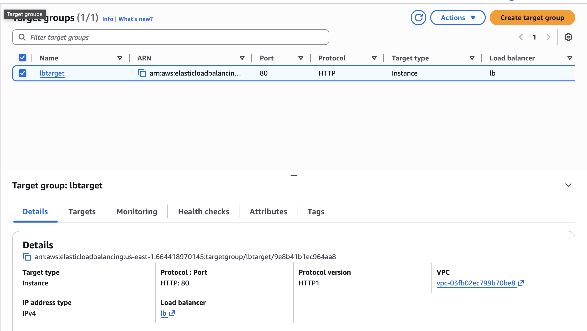
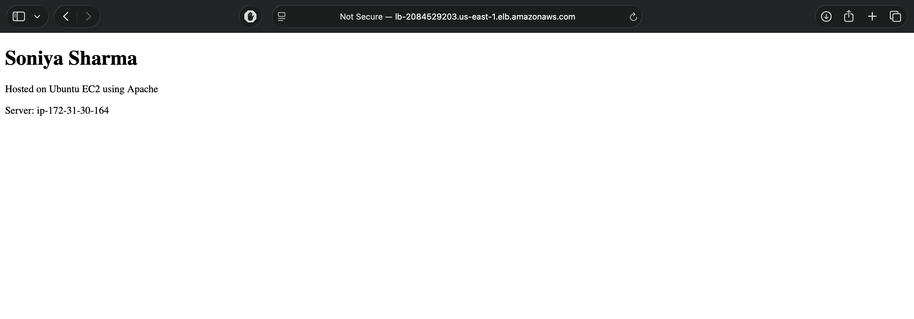
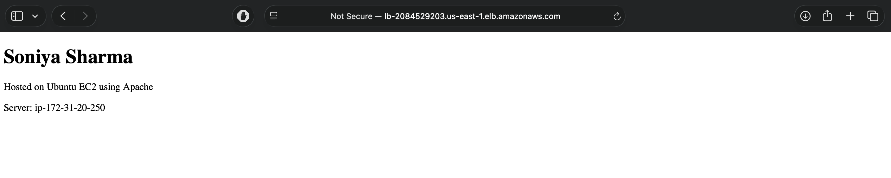

## Load balance traffic on two websites using aws load balancer
## Prerequisites
- Two EC2 instances running **Ubuntu 24.04**
- Port **22 (SSH)** and **80 (HTTP)** allowed in the security group
- PEM key file downloaded on local machine
- SSH access to both instances



---

## Web Server 1 & 2 Setup

### Step 1: Connected to EC2 Instance
```bash
ssh -i "cloudtech-soniya.pem" ubuntu@<public-ip-server-1>
```

### Step 2: Update System Packages

```bash
sudo apt update
```

### Step 3: Installed Apache Web Server

```bash
sudo apt install apache2 -y
```

### Step 4: Started and Enabled Apache

```bash
sudo systemctl start apache2
sudo systemctl enable apache2
```

### Step 5: Installed PHP

```bash
sudo apt install php -y
```

### Step 6: Create Web Page

```bash
cd /var/www/html
sudo nano index.php
```

Add the following content:

```
<!DOCTYPE html>
<html>
<head>
  <title>Soniya Sharma</title>
</head>
<body>
  <h1>Soniya Sharma</h1>
  <p>Hosted on Ubuntu EC2 using Apache</p>
  <p>Server: <?php echo gethostname(); ?></p>
</body>
</html>

```



### Step 7: Restart Apache

```bash
sudo systemctl restart apache2
```

### Step 8: output



---

## Step 10: Created a Target Group

1. **EC2 → Target Groups**
2. Click **Create target group**

### Target Group Configuration

* Target type: **Instances**
* Protocol: **HTTP**
* Port: **80**
* VPC: Selected VPC
* Health check path: `/`


### Registered Targets

* Selected both EC2 instances
* Clicked **Include as pending below**
* Clicked **Create target group**


---

## Step 12: Created Application Load Balancer

1. **EC2 → Load Balancers**
2. Clicked **Create load balancer**
3. Choosed **Application Load Balancer**

### Basic Configuration

* Name: `lb`
* Scheme: **Internet-facing**
* IP address type: **IPv4**

### Network Mapping

* Selected VPC
* Choosed  **two availability zones**
* Selected subnets where EC2 instances exist

---



## Step 13: Configure Security Group

* Inbound rule:

  * HTTP (80) from `0.0.0.0/0`
* Outbound rule:

  * Allow all traffic

---

## Step 14: Listener and Routing

* Listener protocol: **HTTP**
* Listener port: **80**
* Default action: **Forward to target group**
* Select the previously created target group

Click **Create load balancer**

---

## Step 14: Verify Target Health

1.  **Target Groups**
2. Selected target group
3. Checked **Targets tab**
4. Ensured both instances show **Healthy**


---

## Step 14: Test Load Balancing

1. Copied the **DNS name** of the load balancer

   ```
   lb-2084529203.us-east-1.elb.amazonaws.com
   ```

2. Opened it in a browser

3. Refreshed  multiple times

### Expected Output

* Sometimes:

  ```
  Response from Web Server 1
  ```
  


* Sometimes:

  ```
  Response from Web Server 2
  ```
  


This confirms traffic is being load balanced.

---


