# Create S3 bucket with no public access and ACL disabled, Create IAM policy for ec2 to access s3

---

# STEP 1 — Created Private S3 Bucket

---

## 1. Opened S3 Service

AWS Console → Search → **S3** → Click **Create bucket**

---

## 2. Configured Bucket

### Bucket Type

Selected:

```
General Purpose
```

---

### Bucket Name

```
soniya-s3-bucket
```
---

### Region

Choosed:

```
us-east-1 (same region as EC2)
```

---

## 3. Disabled ACLs

Selected:

```
Bucket owner enforced (ACLs disabled)
```

This ensures:

* Access controlled only through IAM policies


---

## 4. Blocked Public Access

Enabled:

```
Block ALL public access
```

This prevents:

* Public bucket policies
* Public ACL permissions

---

## 5. Enabled Encryption

Selected:

```
Server-side encryption with Amazon S3 managed keys (SSE-S3)
```

---

## 6. Created Bucket

Clicked:

```
Create bucket
```

---
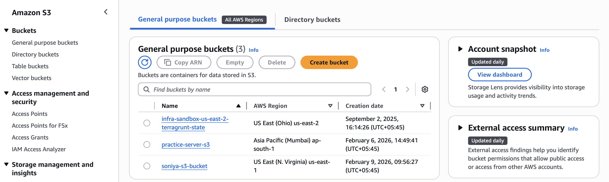

# STEP 2 — Created IAM Policy For S3 Access

---

## 1. IAM

AWS Console → IAM → Policies → Create policy

---

## 2. Selected JSON Editor

```json
{
  "Version": "2012-10-17",
  "Statement": [
    {
      "Sid": "ListBucket",
      "Effect": "Allow",
      "Action": "s3:ListBucket",
      "Resource": "arn:aws:s3:::soniya-s3-bucket"
    },
    {
      "Sid": "ObjectAccess",
      "Effect": "Allow",
      "Action": [
        "s3:GetObject",
        "s3:PutObject",
        "s3:DeleteObject"
      ],
      "Resource": "arn:aws:s3:::soniya-s3-bucket/*"
    }
  ]
}
```
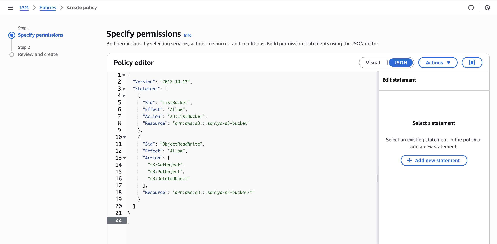
---

## 3. Named Policy

```
soniya-s3-policy
```

Clicked:

```
Create policy
```
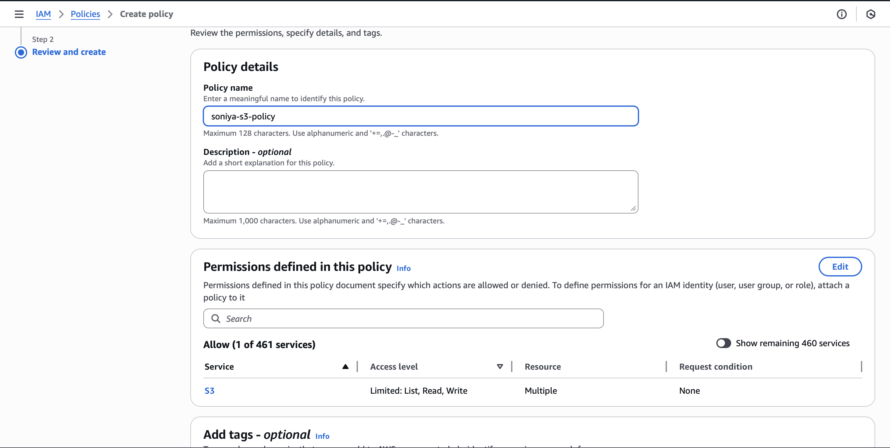
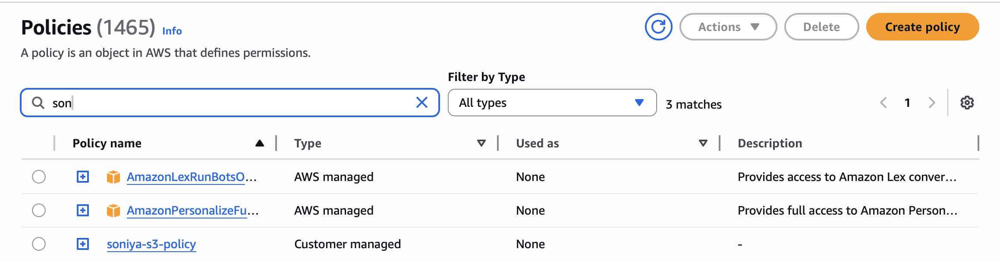

---

# STEP 3 — Create IAM Role For EC2

## 1. IAM → Roles → Create role
---

## 2. Selected Trusted Entity

Choosed:

```
AWS Service
```

Use Case:

```
EC2
```
---
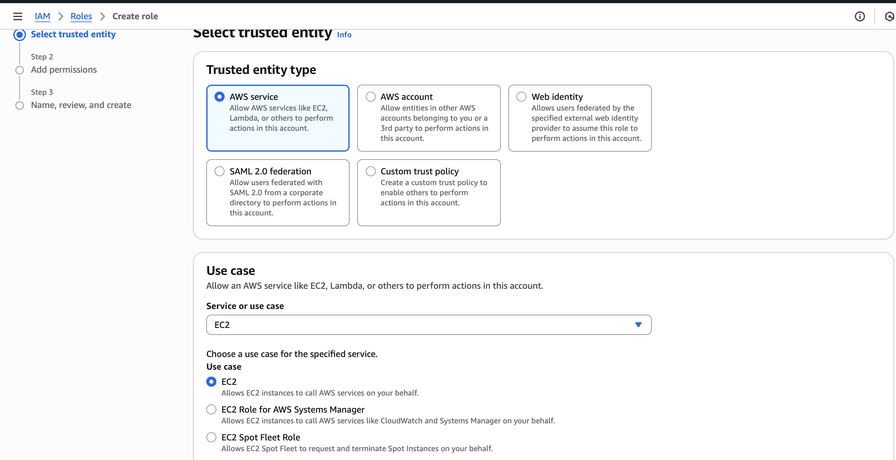

## 3. Attached Policy

Select:

```
soniya-s3-policy
```

---

## 4. Named Role

```
soniya-ec2-s3-access-role
```

Clicked:

```
Create role
```

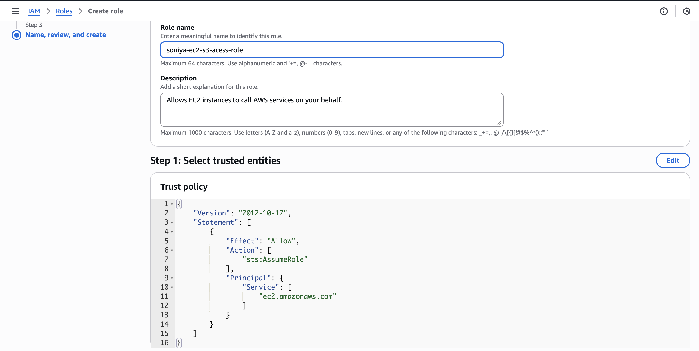
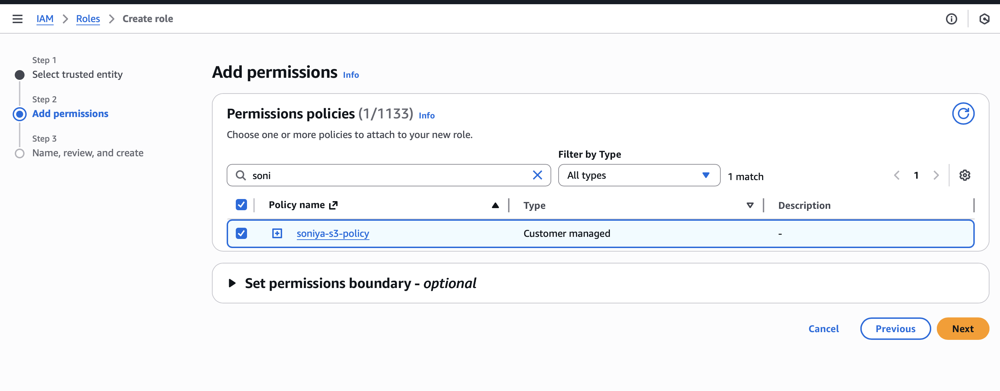
---

# STEP 4 — Launched EC2 Instance

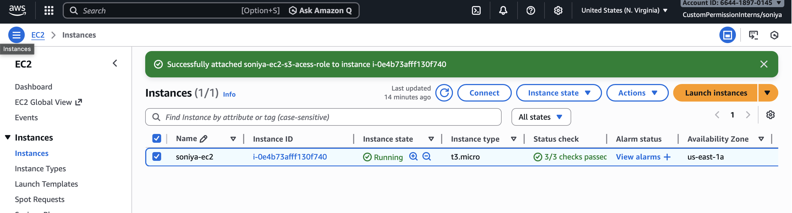

---

# STEP 5 — Connected To EC2

Use SSH:

```
ssh -i key.pem ubuntu@public-ip
```

---

# STEP 6 — Installed AWS CLI (Ubuntu Only)

---

### Updated System

```
sudo apt update
```

---

### Installed unzip

```
sudo apt install unzip -y
```

---

### Downloaded AWS CLI

```
curl "https://awscli.amazonaws.com/awscli-exe-linux-x86_64.zip" -o "awscliv2.zip"
```

---

### Unziped

```
unzip awscliv2.zip
```

---

### Installed

```
sudo ./aws/install
```

---

### Verified

```
aws --version
```

---

# STEP 7 — Verified IAM Role

Run:

```
aws sts get-caller-identity
```

Output showed:

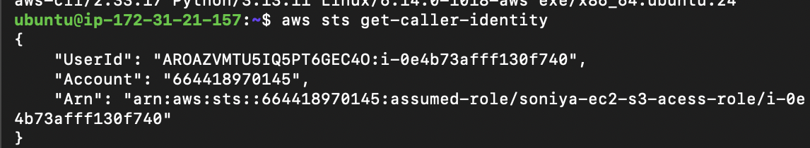

---

# STEP 8 — Tested S3 Access

---

## Listed Objects In Bucket

```
aws s3 ls s3://soniya-s3-bucket
```


---

## Uploaded File

```
echo "hello" > test.txt
aws s3 cp test.txt s3://soniya-s3-bucket/
```

---

## Confirmed Upload

```
aws s3 ls s3://soniya-s3-bucket
```
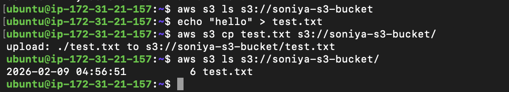
---

## Download File

```
aws s3 cp s3://soniya-s3-bucket/test.txt download.txt
```
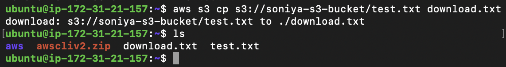
---


# RESULT

EC2 can now securely:

* Upload files to S3
* Download files from S3
* List objects inside bucket

