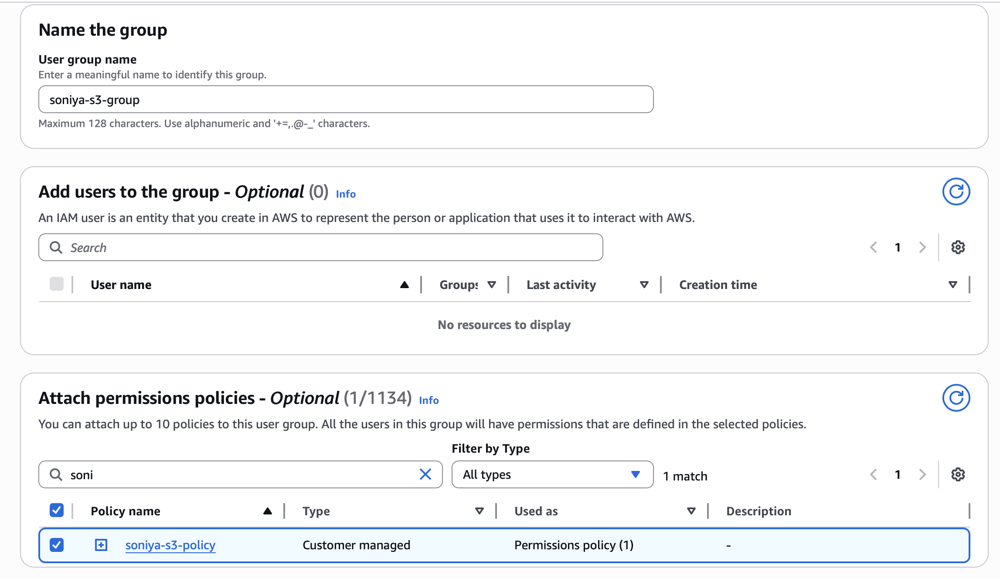
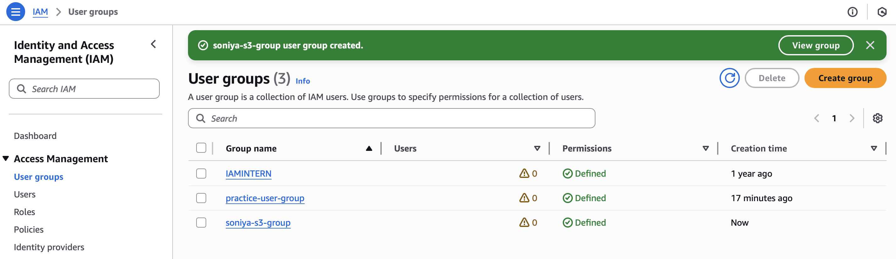
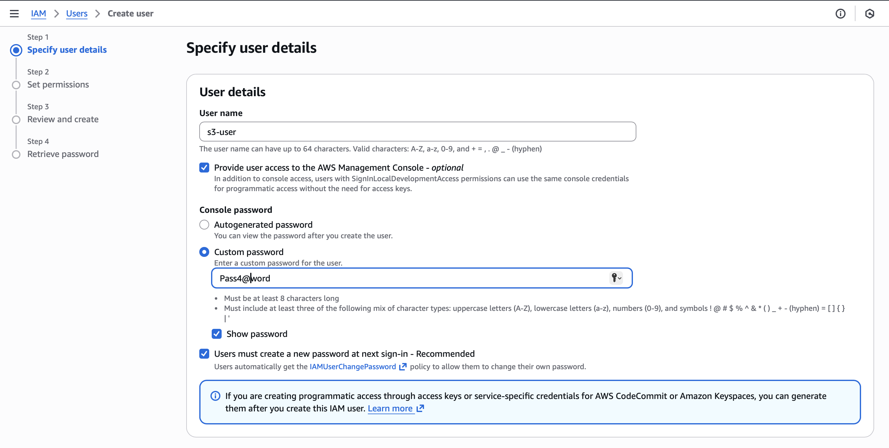
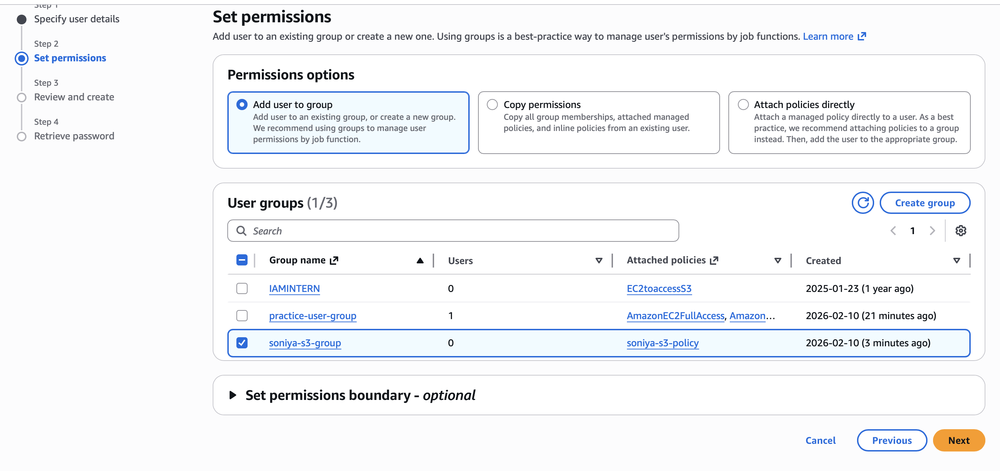
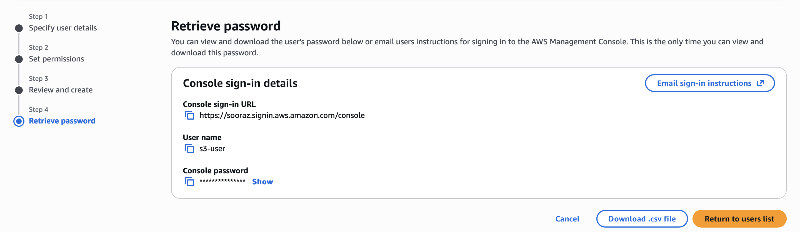
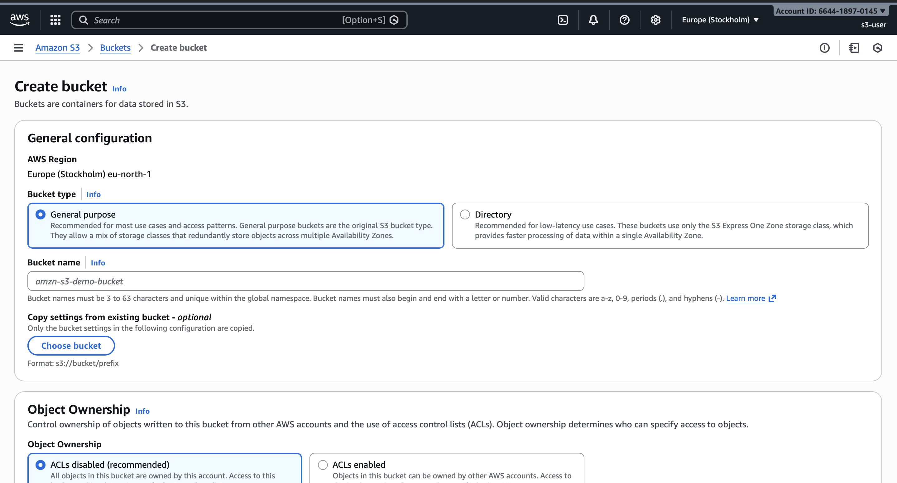
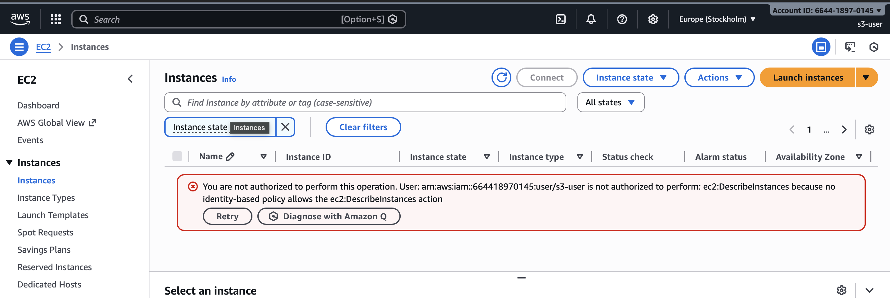

# Understanding IAM , Creating IAM Group & Adding Users,Understanding AWS Cost Explorer

##  What is IAM?
IAM is a web service that help securely control access to AWS resources by managing users, permissions and credentials

## IAM policies
- Define who is allowed to do what with which AWS resources
- Control access to AWS services and resources
-  A set of rules in a JSON format
- Helps keep aws environment secure
- Can be attached to three types of entities (Users,Groups,Roles)

## Types of IAM policies:
- AWS Managed policies
- Customer Managed policies
- Inline policies

### AWS Managed Policies
- Created and managed by AWS
- Designed for common use cases across a wide range of aws services
- Ready to attach to muliplt IAM users, groups, or roles within an AWS account.
- Automatically updated by AWS to grant access to new services or actions without requiring manual policy updates.
- Provide easy way to quickly assign necessary permisiions based on job function or application need.
- Divided into two types :
    - AWS managed policies 
    - Service-linked policies
- Limitations
    - Resource-Specific Access Control
    - No Customization
    - Broad Permissions
    - Dependence on Aws
    - Understanding Complexity

### Customer Managed Policies 
- Created and Managed by Users
- Tailored for specific needs
- Attachable to mulitple IAM entities
- Manual Update Required
- Enables Fine-grained Permission Control
- Versioning and Rollback 

### Inline Policies
- Inline policies are policies that are directly embeded within a single IAM user, group or role.
- This constrats with managed policies, which exist as separate entities in AWS and can be attached to multiple IAM useers, groups or roles.

## IAM entities
- IAM entities are the core of access control in AWS
- They define who can access resources 
- IAM policies define what actions those entities can perform and on which resources.
- Types : User, Group  and Role

### IAM User
- An individual entity representing a human user who needs access to AWs resources.
- Users are used to direclty interact with AWs services and resources.

### IAM group
- A collection of IAM users within your AWS account for easier permission management.
- Simplify assignment and management of IAM user permissions
- Grant users access to specific AWS resources and services based on thier group membership
- Groups reduces the need for individual user policy management 

### IAM role
- AN IAM role is IAM identitiy that you can create in your account that has specific permissions.
- A role is for anyone who needs it, not just for one person, unlike an IAM user.
- A role gives you temporary credentials when assigned, unlike IAM users , for whom we create long term passwords or access keys 
- You can use role to delegate access to users, applications or services that don't normally have access to your AWS resources.

---

# Created IAM Group & Adding Users 

### Step 1: Login to AWS Console

Go to:
  AWS Console → IAM → User Groups

### Step 2: Created IAM Group

1. Clicked **Create Group**

2. Enter Group Name

3. Attach Permission Policies

4. Click **Create Group**

---

## Step 3: Create IAM User

1. Go to IAM → Users
2. Click **Create User**
3. Enter username
4. Select access type:

   * Console access (login portal)
   * Programmatic access (CLI/API)

---

## Step 4: Add User to Group

1. During user creation → Choose group
2. Select previously created group
3. Finish user creation

User automatically inherits group permissions.

---

# Advantages of Using IAM Groups

✔ Easy permission management
✔ Consistent access control
✔ Scalable user management

---

# Best IAM Security Practices

✔ Use groups instead of individual permissions
✔ Enable MFA (Multi-Factor Authentication)
✔ Avoid using root account
✔ Rotate credentials regularly
✔ Use roles for AWS services

---

