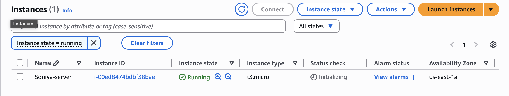
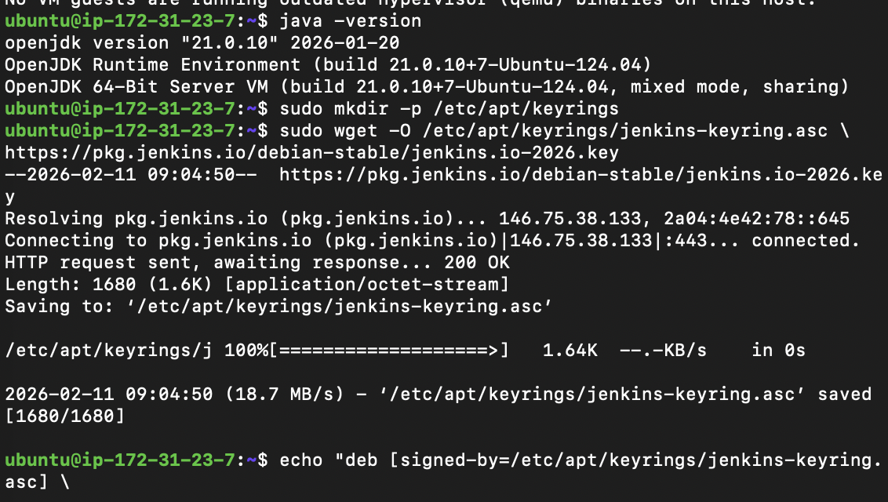
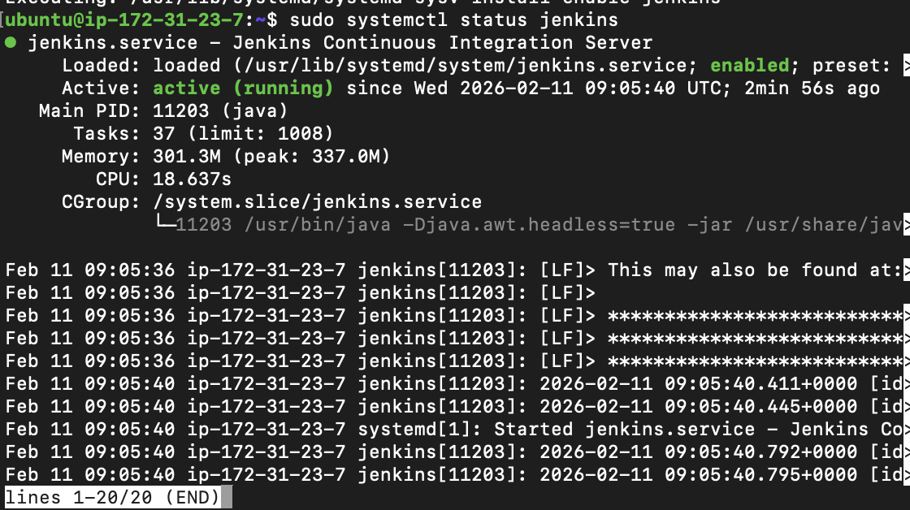
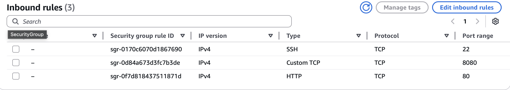
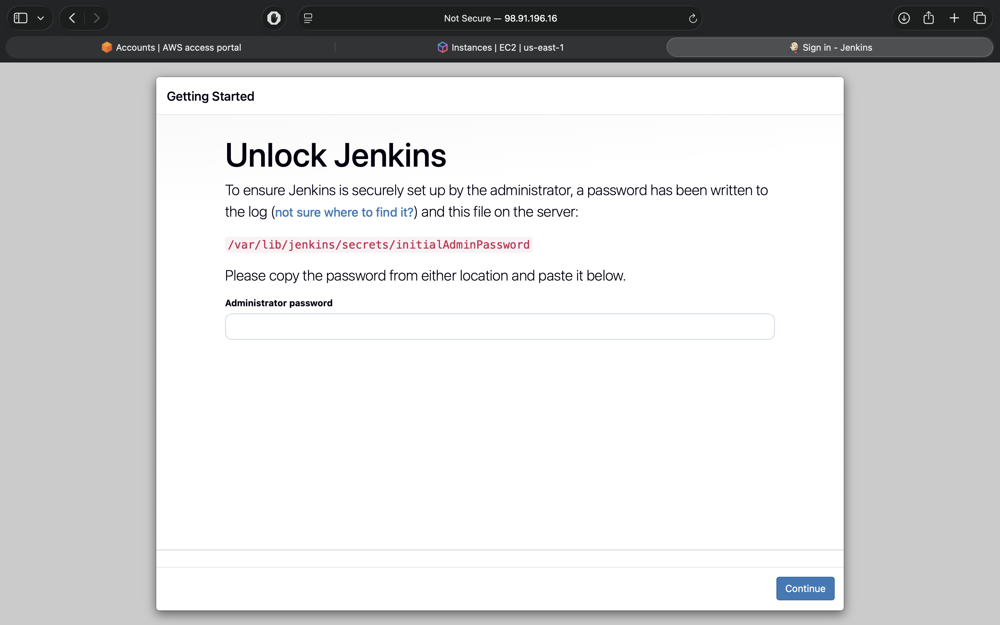

## Infrastructure as Code
Infrastructure as Code (IaC) means creating and managing cloud resources using code instead of doing everything manually.This process, when running, automates the sequence and process of creating databases, virtual machines, and servers. This improves the user experience by reducing the frequency of manual cloud service deployments, especially for multiple identical services.

## What IaC Actually Does ?
Instead of clicking buttons in cloud platforms like AWS, Azure, or Google Cloud, you:
 - Write a configuration file
 - Run the file
 - Cloud resources get created automatically
This helps:
 - Save time
 - Avoid mistakes
 - Create identical setups repeatedly
 - Make systems easier to maintain


## Two Main Types of IaC Approaches
### Declarative Approach (Describe the Final Result)
 - You only say what you want.
 - The tool decides how to build it.
Example idea:
"I want 2 servers and 1 database."
You do NOT explain how to create them step-by-step.

### Imperative Approach (Explain Every Step)
 - You describe how to build it step-by-step.
Example idea:
Create server
Install software
Configure database
Connect everything

## Languages Used in IaC
These tools use special configuration formats like:
- YAML
- JSON
- HCL (used by Terraform)

## Terraform
Terraform is a tool for building, changing and versioning infrastructure safely and efficiently.

## Benefits of Terraform — Easy Explanation

- Declarative Approach (You Say What You Want)

    With Terraform, you just describe the **final infrastructure you need**.

    Example:

    * 2 servers
    * 1 database
    * 1 network

    Terraform automatically figures out **how to create them**.

- Conflict Handling (Checks Problems Before Creating)

    Terraform has a special feature called **terraform plan**.

    It shows what Terraform is about to create or change **before it actually does it**.

- Cloud Agnostic (Works with Many Cloud Platforms)

    Terraform is not limited to one cloud provider.

    It works with:

    * AWS
    * Azure
    * Google Cloud
    * Hybrid cloud systems
    * Multiple cloud providers together


- User-Friendly & Large Community

    Terraform is widely used worldwide.

- File Management & State Backup

    Terraform keeps track of infrastructure using a **state file**.

    This file:

    * Stores information about created resources
    * Helps Terraform know what exists already
    * Prevents duplicate creation

    Terraform can store this file:
    * Locally on your computer
    * Remotely in cloud storage (safer for teams)

- Version Control (Track Changes Over Time)

    Terraform lets you track infrastructure changes like software code.

    We can:
    ✔ See who changed what
    ✔ Restore older working versions
    ✔ Prevent configuration mistakes

- Code Reusability (Write Once, Use Many Times)

    Terraform allows you to reuse infrastructure templates.


---

### **Common Terraform Terms — Short Exam Notes**

**1. Provider**

* Interface that allows Terraform to interact with cloud platforms and APIs.
* Examples: AWS, Azure, Google Cloud providers.
* Used to create and manage cloud infrastructure.

---

**2. Modules**

* Reusable collection of Terraform configuration files.
* Helps organize infrastructure and avoid repeating code.
* Supports variables for customization.

---

**3. Resources**

* The actual infrastructure components created by Terraform.
* Examples: Virtual machines, databases, networks, storage, load balancers.
* Basic building blocks of Terraform.

---

**4. State**

* A file that stores the current status of infrastructure managed by Terraform.
* Tracks created, modified, and deleted resources.
* Helps Terraform detect changes and update infrastructure efficiently.

---

**5. Workspace**

* Allows management of multiple environments using the same Terraform configuration.
* Common environments: Development, Staging, Production.
* Keeps infrastructure states separate and organized.

---
# Install Jenkins on an AWS EC2 instance

---

## 1. Launched and connected to EC2

* Launched an EC2 instance with **Ubuntu**.
* Instance type: t2.micro is enough for practice.
* Security group:

  * SSH: port 22
  * Jenkins: port 8080

  

---
## I used jenkins documentation for installation:
https://www.jenkins.io/doc/book/installing/linux/#debianubuntu
## 2. Updated the system

```bash
sudo apt update
sudo apt upgrade -y
```

---

## 3. Installed Java (Mandatory)

Jenkins requires Java. OpenJDK is recommended.
Ubuntu 24.04 supports **OpenJDK 21**, which is compatible with Jenkins.

```bash
sudo apt install fontconfig openjdk-21-jre -y
```

Verify installation:

```bash
java -version
```

Expected output:

```
openjdk 21.0.x
OpenJDK Runtime Environment
OpenJDK 64-Bit Server VM
```

Installing Java first avoids the error:

```
jenkins: failed to find a valid Java installation
```

---

## 4. Choosed Jenkins Release

Jenkins provides two releases:

* **LTS (Long Term Support)**
  Stable and recommended for production and learning.

* **Weekly Release**
  Contains latest features, less stable.

This guide uses **LTS**.

---

## 5. Added Jenkins LTS Repository

### Created keyrings directory

```bash
sudo mkdir -p /etc/apt/keyrings
```

### Added Jenkins GPG key

```bash
sudo wget -O /etc/apt/keyrings/jenkins-keyring.asc \
https://pkg.jenkins.io/debian-stable/jenkins.io-2026.key
```

### Added Jenkins repository

```bash
echo "deb [signed-by=/etc/apt/keyrings/jenkins-keyring.asc] \
https://pkg.jenkins.io/debian-stable binary/" | sudo tee \
/etc/apt/sources.list.d/jenkins.list > /dev/null
```

Update package list:

```bash
sudo apt update
```

---

## 6. Installed Jenkins

```bash
sudo apt install jenkins -y
```

---

## 7. Started and Enabled Jenkins

```bash
sudo systemctl start jenkins
sudo systemctl enable jenkins
```

Check status:

```bash
sudo systemctl status jenkins
```

You should see:

```
Active: active (running)
```

---

## 8. Opened Firewall or EC2 Security Group

### If using EC2

Add an inbound rule:

* Type: Custom TCP
* Port: 8080
* Source: Your IP or 0.0.0.0/0 (learning only)



---

## 9. Accessed Jenkins Web Interface

Open browser:

```
http://<server-ip>:8080
```

---

## 10. Unlocked Jenkins

Get the initial admin password:

```bash
sudo cat /var/lib/jenkins/secrets/initialAdminPassword
```

Paste it into the Jenkins setup page.

---

## 11. Completed Jenkins Setup

* Select **Install suggested plugins**
* Create admin user
* Finish setup

Jenkins dashboard will appear.

---

## 12. Stop, Start, Restart Jenkins

```bash
sudo systemctl stop jenkins
sudo systemctl start jenkins
sudo systemctl restart jenkins
```


