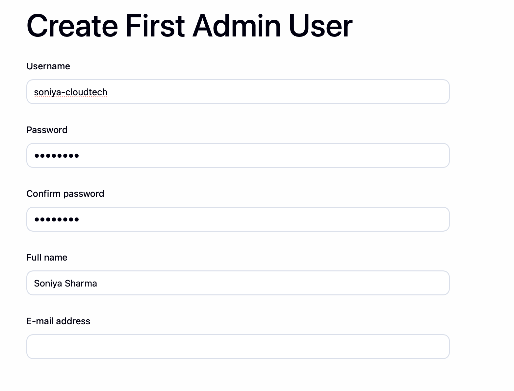
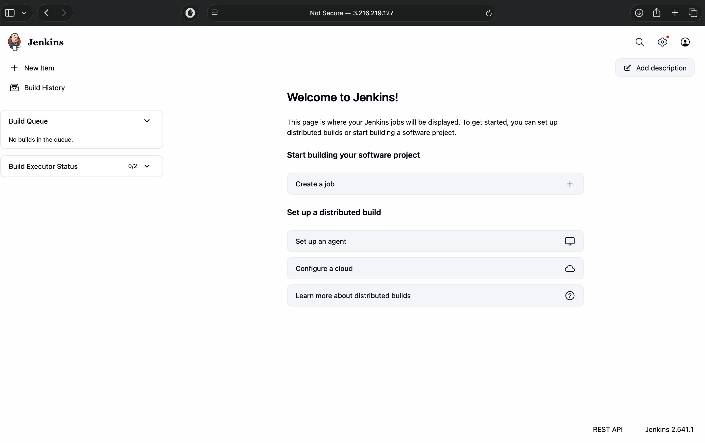
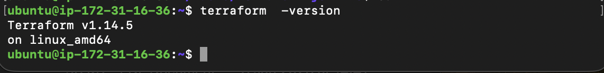
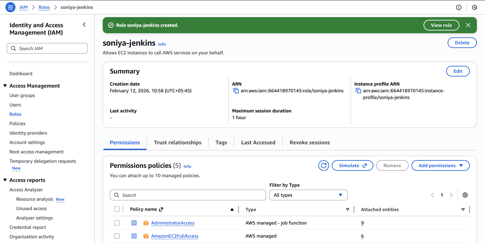
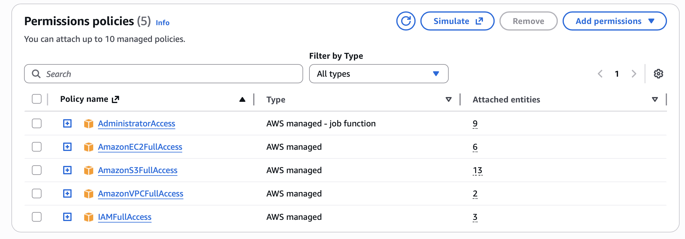
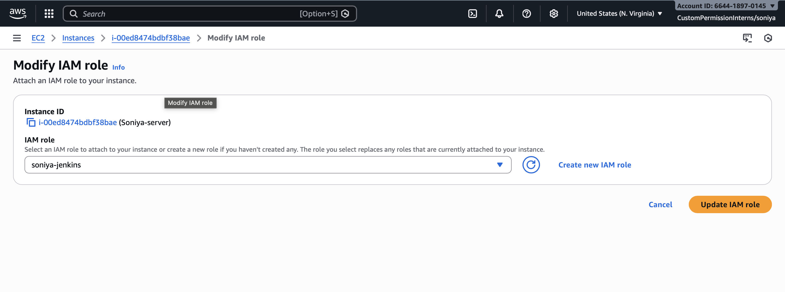
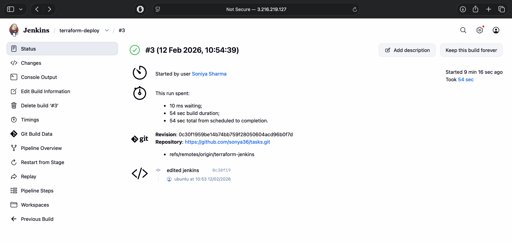
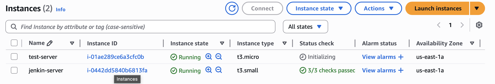
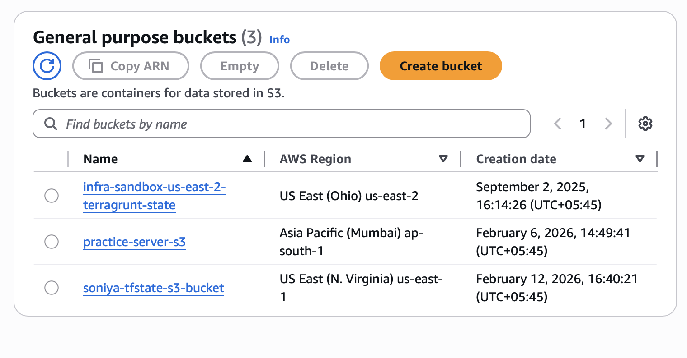

**Week3 Day 2: Set up a Jenkins pipeline to deploy Terraform infrastructure**

## 1. Prerequisites

* Jenkins is running and reachable on ec2 server. This has already been setup in previous projects.However, user has not been setup yet.



* Terraform is installed on the Jenkins server.
* Git is installed on the Jenkins server.
* An IAM user or role exists with permission to create the required AWS resources.
* Your Terraform code is in a Git repository.

---
## 2. Install Terraform on the Jenkins server
Used: https://developer.hashicorp.com/terraform/install
1. Update the system packages.

   ```bash
   sudo apt update
   ```

2. Download Terraform.

    ```bash
    wget -O - https://apt.releases.hashicorp.com/gpg | sudo gpg --dearmor -o /usr/share/keyrings/hashicorp-archive-keyring.gpg
    ```
    ```bash
    echo "deb [arch=$(dpkg --print-architecture) signed-by=/usr/share/keyrings/hashicorp-archive-keyring.gpg] https://apt.releases.hashicorp.com $(grep -oP '(?<=UBUNTU_CODENAME=).*' /etc/os-release || lsb_release -cs) main" | sudo tee /etc/apt/sources.list.d/hashicorp.list
    ```
   ```bash
    sudo apt update && sudo apt install terraform
   ```

3. Verify installation.

   ```bash
   terraform -version
   ```


---

## 3. Install Git

```bash
sudo apt install -y git
```

---

## 4. Create IAM Role (MOST IMPORTANT STEP)

---

Go to:

```
AWS Console → IAM → Roles → Create Role
```

---

### Select

```
AWS Service → EC2
```

---

### Attach Policies (Balanced DevOps Setup)

```
AmazonEC2FullAccess
AmazonS3FullAccess
AmazonVPCFullAccess
IAMFullAccess
```

---

### Create Role

```
soniya-jenkins
```



### Attach this role to ec2

---
## 5. GitHub Repository Structure

Create a public GitHub repository.

```text
tasks/
├── terraform-jenkins/
    ├── main.tf
    ├── Jenkinsfile

```
## 6. Terraform Code

```bash
    provider "aws" {
    region = "us-east-1"
    }

    resource "aws_s3_bucket" "tfstate_bucket" {
    bucket = "soniya-tfstate-s3-bucket"
    }

    resource "aws_s3_bucket_versioning" "tfstate_versioning" {
    bucket = aws_s3_bucket.tfstate_bucket.id
    versioning_configuration {
        status = "Enabled"
    }
    }

    data "aws_ami" "ubuntu" {
    most_recent = true
    owners      = ["099720109477"]

    filter {
        name   = "name"
        values = ["ubuntu/images/hvm-ssd/ubuntu-jammy-22.04-amd64-server-*"]
    }
    }

    resource "aws_instance" "test_server" {
    ami           = data.aws_ami.ubuntu.id
    instance_type = "t3.micro"

    tags = { Name = "test-server" }
    }
```


## 7. Create a Jenkins pipeline job

1. Go to **New Item**.
2. Choose **Pipeline**.
3. Name it `terraform-deploy`.
4. Select **Pipeline script from SCM**.
5. Choose Git and paste  repository URL.
6. Set branch to */terraform-jenkins.
7. Script path terraform-jenkins/Jenkinsfile

---

## 8. Write the Jenkinsfile

Add this `Jenkinsfile` at the root of your repo.

```bash
pipeline {
  agent any

  options {
    skipDefaultCheckout(true)
    timestamps()
  }

  stages {
    stage('Checkout') {
      steps {
        checkout scm
      }
    }

    stage('Terraform Init') {
      steps {
        dir('terraform-jenkins') {
          sh 'terraform init'
        }
      }
    }

    stage('Terraform Validate') {
      steps {
        dir('terraform-jenkins') {
          sh 'terraform validate'
        }
      }
    }

    stage('Terraform Plan') {
      steps {
        dir('terraform-jenkins') {
          sh 'terraform plan'
        }
      }
    }

    stage('Terraform Apply') {
      steps {
        dir('terraform-jenkins') {
          sh 'terraform apply -auto-approve'
        }
      }
    }
  }
}
```

---

## 9. Run the pipeline

* Click **Build Now**.
* Watch the console output.

* Confirm resources are created in AWS.



---


